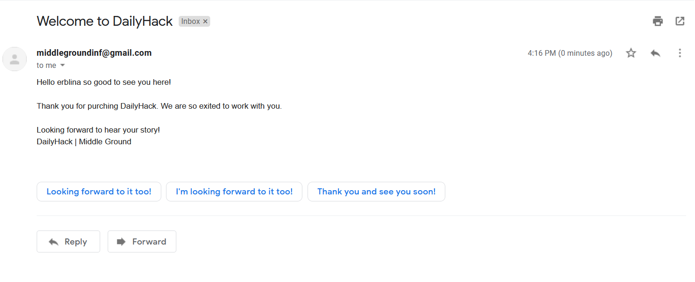

# Daily Hack - Fullstack application in django&python

Characteristic of the app is that every time a user is registered Django send's an welcome email to the user. Bellow is how a message looks like. Other than that, you can add notes, calendar events and to-do list where is going to be saved in the application. Source of the email, or email host is middlegroundinf@gmail.com. By just sending a welcome email to the users that register in the application

The front end is from App-land Bootstrap:

https://bootstrapmade.com/free-bootstrap-app-landing-page-template/

The backend part is build in Django:

https://docs.djangoproject.com/en/3.1/

